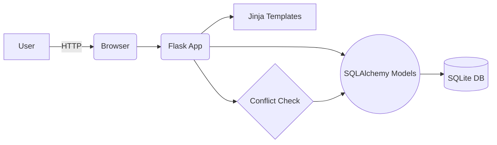
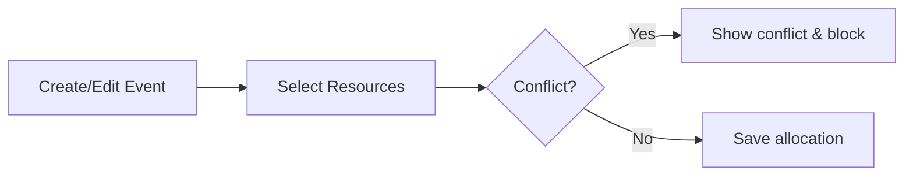

# Event Scheduler & Resource Manager

[](https://github.com/Jaisrinivasan23/Event-Manager-Aerele/actions/workflows/smoke-test.yml)

A compact, practical Flask app to manage events, resources and allocations with automatic conflict detection and lightweight reporting.

---

## Quick Start (3 commands)

```bash
python -m venv venv
venv\Scripts\activate    # PowerShell/Windows
pip install -r requirements.txt
flask run
```

Open http://127.0.0.1:5000/ and use **Seed Data** to populate sample data.

---

## Key Features (short)
- Events CRUD with validation (start < end)
- Resources CRUD with categories and quick inline add
- Allocate multiple resources per event with conflict prevention
- Date-range utilization report and upcoming bookings
- Simple, testable codebase (smoke tests included)

---

## Architecture (visual)



## Allocation flow



---

## Screenshots
_Add images under `static/img/screenshots/` and they will render here._


---

## Quick commands
- Run smoke tests: `python scripts/smoke_test.py`
- Apply migrations: `flask db migrate -m "msg" && flask db upgrade` (requires Flask-Migrate)
- Recreate DB (destructive): delete `events.db`, then start app and `/seed` to re-seed

---

## Contributing
- Keep changes small and add a smoke test for new behavior
- Use `flask db migrate` for schema changes

---

## License & Contact
Educational, use freely. Questions? Open an issue or contact the author.
def check_resource_conflict(resource_id, start_time, end_time, exclude_event_id=None):
    # Two events overlap if:
    # event1.start_time < event2.end_time AND event2.start_time < event1.end_time
    
    allocations = get_resource_allocations(resource_id)
    
    for allocation in allocations:
        event = allocation.event
        
        if exclude_event_id and event.id == exclude_event_id:
            continue  # Skip current event when editing
        
        if start_time < event.end_time and event.start_time < end_time:
            # Conflict detected!
            return True
    
    return False
```

### Example Scenarios

**Scenario 1: Conflict Detected**
- Event A: Room 101, 2:00 PM - 4:00 PM
- Event B: Room 101, 3:00 PM - 5:00 PM
- Result: ❌ Conflict! Room 101 is already booked

**Scenario 2: No Conflict**
- Event A: Room 101, 2:00 PM - 4:00 PM
- Event B: Room 101, 4:00 PM - 6:00 PM
- Result: ✅ No conflict, times don't overlap

## 📊 Database Schema

### Event Table
```sql
event_id (PK)
title
start_time
end_time
description
```

### Resource Table
```sql
resource_id (PK)
resource_name
resource_type
```

### EventResourceAllocation Table
```sql
allocation_id (PK)
event_id (FK → Event)
resource_id (FK → Resource)
allocated_at
```

## 🎥 Demo Video Instructions

To create a demonstration video:

1. **Introduction** (30 seconds)
   - Show the home page
   - Explain the purpose of the application

2. **Load Sample Data** (15 seconds)
   - Click "Seed Data"
   - Show confirmation message

3. **Events Management** (1 minute)
   - List events page
   - Add a new event
   - Edit an existing event
   - Show event deletion

4. **Resources Management** (45 seconds)
   - List resources page
   - Add a new resource
   - Edit a resource

5. **Resource Allocation** (1.5 minutes)
   - Navigate to Allocate page
   - Select an event
   - Choose multiple resources
   - Demonstrate successful allocation
   - **Conflict Detection**: Try to allocate the same resource to overlapping events
   - Show error message preventing the conflict

6. **Allocations List** (30 seconds)
   - View all allocations
   - Show details (event, resource, time)
   - Delete an allocation

7. **Reports** (1 minute)
   - Generate a report for a date range
   - Show total hours used
   - Display upcoming bookings
   - Explain summary statistics

8. **Conclusion** (15 seconds)
   - Summarize key features
   - Mention conflict detection as primary feature

**Total Duration**: 5-6 minutes

## 📝 Assignment Submission Checklist

- [x] Complete project structure created
- [x] All CRUD operations implemented
- [x] Conflict detection working correctly
- [x] Resource utilization report functional
- [x] Bootstrap UI implemented
- [x] Sample data seeder included
- [x] README.md with complete documentation
- [x] Clean, commented code
- [x] Database models with proper relationships
- [x] Form validation (start_time < end_time)
- [x] Flash messages for user feedback
- [x] Responsive design

## 🐛 Troubleshooting

### Database Issues
If you encounter database errors, delete `events.db` and restart the application. The database will be recreated automatically.

### Port Already in Use
If port 5000 is busy, modify `app.py`:
```python
if __name__ == '__main__':
    app.run(debug=True, port=5001)
```

### Import Errors
Ensure all dependencies are installed:
```bash
pip install flask flask-sqlalchemy
```

## 🔐 Security Notes

- Change `SECRET_KEY` in `config.py` for production use
- Do not commit `events.db` to version control (add to `.gitignore`)
- Implement user authentication for production deployment
- Add CSRF protection for forms in production

## 🌟 Future Enhancements

- User authentication and authorization
- Email notifications for upcoming events
- Calendar view for events
- Export reports to PDF/Excel
- Resource availability checker
- Recurring events support
- Mobile responsive improvements
- REST API for external integrations

## 👨‍💻 Developer Notes

- The application uses Flask's development server (not for production)
- SQLite is suitable for development; consider PostgreSQL for production
- All routes include error handling with appropriate HTTP status codes
- Templates use Jinja2 templating engine
- Bootstrap CDN is used (requires internet connection)

## 📄 License

This project is created for educational purposes as part of an academic assignment.

## 📧 Contact

For questions or issues, please contact the development team.

---

**Built with ❤️ using Flask and Bootstrap**
