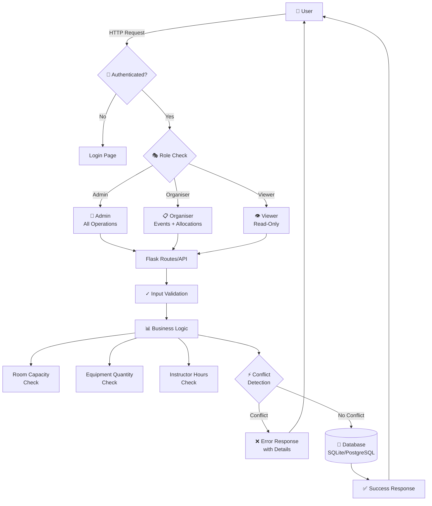

# Event Scheduler & Resource Manager

[]()
[]()
[]()
[]()
[]()

A production-ready Flask web application for intelligent event scheduling and resource management with user authentication, role-based access control, automatic conflict detection, resource validation, REST API, and Docker support.

**🎯 Built for Aerele Technologies Hiring Assignment**

---

## 🎥 Live Demo

**[📹 Watch Video Demo](https://drive.google.com/file/d/1O1MkZjrCzSGL5XyoKAr0JjGhyj_jqnAQ/view?usp=sharing)** - Full application walkthrough showcasing all features

---

## 📖 Table of Contents

- [Live Demo](#-live-demo)
- [Features](#-features)
- [Quick Start](#-quick-start)
  - [Local Development](#option-1-local-development-no-docker)
  - [Docker Development](#option-2-docker-development-hot-reload)
  - [Docker Production](#option-3-docker-production-postgresql)
- [Architecture](#-architecture)
- [Database Schema](#-database-schema)
- [Implementation Details](#-implementation-details)
- [Docker Deployment Guide](#-docker-deployment-guide)
- [Testing](#-testing)
- [API Documentation](#-api-documentation)
- [Screenshots](#-screenshots)
- [Project Structure](#-project-structure)
- [Technology Stack](#-technology-stack)

---

## ✨ Features

### Core Functionality
- ✅ **Event Management** - Complete CRUD with validation (start < end, timezone support, expected attendees)
- ✅ **Resource Management** - Venues, equipment, and personnel with categories and constraints
- ✅ **Smart Allocation** - Multi-resource allocation with quantity tracking
- ✅ **Intelligent Conflict Detection** - Detects all time overlap scenarios (partial, full, nested, boundary, exact)
- ✅ **Utilization Reports** - Date-range filtering, upcoming bookings, historical analytics

### Advanced Features
- ✅ **User Authentication** - Secure login/register with password hashing (Werkzeug PBKDF2)
- ✅ **Role-Based Access Control** - Admin, Organiser, Viewer with granular permissions
- ✅ **Real-World Resource Validation**:
  - **Room Capacity**: Validates expected attendees ≤ room capacity
  - **Equipment Quantity**: Tracks available units vs reserved (e.g., 2 projectors available)
  - **Instructor Hours**: Enforces max working hours per day (e.g., 8-hour limit)
- ✅ **REST API** - JSON endpoints with authentication for programmatic access
- ✅ **Comprehensive Testing** - 12 unit tests covering all conflict scenarios and edge cases
- ✅ **Enhanced UX** - Detailed error messages, flash notifications, responsive design (Tailwind CSS)
- ✅ **Docker Support** - Dev (SQLite + hot-reload) and Prod (PostgreSQL + Gunicorn) setups
- ✅ **Database Migrations** - Flask-Migrate (Alembic) for schema version control
- ✅ **Health Checks** - Docker health monitoring endpoint

---

## 🚀 Quick Start

### Option 1: Local Development (No Docker)

**Best for**: Traditional Python development

```bash
# 1. Navigate to project
cd event_scheduler

# 2. Create and activate virtual environment
python -m venv venv
venv\Scripts\activate           # Windows
# source venv/bin/activate      # Linux/Mac

# 3. Install dependencies
pip install -r requirements.txt

# 4. Run application (creates database automatically)
python app.py

# 5. Seed sample data
# Visit http://127.0.0.1:5000/seed in browser
```

**Access**: http://127.0.0.1:5000

**Demo Credentials**:
```
Admin:     admin      / admin123
Organiser: organiser  / organiser123
Viewer:    viewer     / viewer123
```

### Option 2: Docker Development (Hot-Reload)

**Best for**: Docker-based development with instant code reflection

```bash
# Start development environment
docker-compose -f docker-compose.dev.yml up

# Access at http://localhost:5000
# Edit code → Save → Browser auto-refreshes ✓
```

**Features**:
- ✓ SQLite database (no PostgreSQL setup needed)
- ✓ Hot-reload enabled (code changes reflect instantly)
- ✓ Debug mode with detailed errors
- ✓ Volume mounting (edit on host, run in container)

### Option 3: Docker Production (PostgreSQL)

**Best for**: Production-like deployment

```bash
# 1. Configure environment
cp .env.example .env
nano .env  # Set SECRET_KEY and POSTGRES_PASSWORD

# 2. Start services (detached mode)
docker-compose up -d

# 3. Initialize database
docker-compose exec web flask db upgrade

# 4. Seed sample data (optional)
docker-compose exec web python -c "
from app import app
from init_db import seed_data
with app.app_context():
    seed_data()
"

# 5. Verify health
curl http://localhost:5000/health
# {"status":"healthy","database":"connected"}
```

**Features**:
- ✓ PostgreSQL database with persistent storage
- ✓ Gunicorn WSGI server (4 workers, production-grade)
- ✓ Automatic health checks every 30s
- ✓ Auto-restart on failure

---

## 🏗️ Architecture

### System Flow Diagram



### Request Flow Example

**Scenario**: Organiser allocates "Conference Room A" to "Python Workshop"

1. **Authentication**: Validate session → Identify user
2. **Authorization**: Check role → Organiser has permission ✓
3. **Input Validation**: Verify event exists, resource exists ✓
4. **Business Rules**:
   - Room capacity (50) ≥ expected attendees (25) ✓
   - No time conflicts with other events ✓
   - Resource available during time slot ✓
5. **Database**: Create `EventResourceAllocation` record
6. **Response**: Success message + allocation details

---

## 📊 Database Schema

### Entity Relationship Diagram

```
┌──────────────┐          ┌───────────────────────────┐          ┌──────────────┐
│     User     │          │ EventResourceAllocation   │          │   Resource   │
├──────────────┤          ├───────────────────────────┤          ├──────────────┤
│ user_id (PK) │─────┐    │ allocation_id (PK)        │     ┌───│ resource_id  │
│ username     │     │    │ event_id (FK)             │     │   │ resource_name│
│ email        │     │    │ resource_id (FK) ●────────┘     │   │ resource_type│
│ password_hash│     │    │ reserved_quantity         │         │ category     │
│ role         │     │    │ allocated_at              │         │ capacity     │
│ is_active    │     │    └───────────────────────────┘         │ quantity     │
└──────────────┘     │                ▲                           │ max_hours    │
                     │                │                           └──────────────┘
                     │    ┌───────────────────┐
                     └───▶│      Event        │
                          ├───────────────────┤
                          │ event_id (PK)     │
                          │ title             │
                          │ start_time        │
                          │ end_time          │
                          │ description       │
                          │ timezone          │
                          │ expected_attendees│
                          │ created_by (FK) ● │
                          └───────────────────┘
```

### Models (Detailed)

**User**
```python
user_id: Integer (Primary Key)
username: String(80), unique, required
email: String(120), unique, required
password_hash: String(255), required  # Werkzeug PBKDF2
role: String(20)  # 'admin' | 'organiser' | 'viewer'
is_active: Boolean (default: True)
created_at: DateTime (auto-generated)

Methods:
- set_password(password) → Hash and store password
- check_password(password) → Validate password
```

**Event**
```python
event_id: Integer (Primary Key)
title: String(200), required
start_time: DateTime, required
end_time: DateTime, required
description: Text (optional)
timezone: String(50), default: 'Asia/Kolkata'
expected_attendees: Integer, default: 0
created_by: Integer (Foreign Key → User.user_id)
created_at: DateTime (auto-generated)

Methods:
- resources → Get all allocated resources
- duration_hours() → Calculate event duration in hours
```

**Resource**
```python
resource_id: Integer (Primary Key)
resource_name: String(200), required
resource_type: String(100), required
category: String(100)  # 'Venue' | 'Equipment' | 'Person'
capacity: Integer (for Venue - maximum occupancy)
quantity: Integer (for Equipment - available units)
max_hours_per_day: Float (for Person - work hour limit)
```

**EventResourceAllocation**
```python
allocation_id: Integer (Primary Key)
event_id: Integer (Foreign Key → Event.event_id)
resource_id: Integer (Foreign Key → Resource.resource_id)
reserved_quantity: Integer, default: 1  # For equipment
allocated_at: DateTime (auto-generated)

Indexes:
- Composite index on (event_id, resource_id) for fast lookups
```

---

## 💡 Implementation Details

### 1. Intelligent Conflict Detection

The system detects all time overlap scenarios using a sophisticated algorithm:

```python
def check_resource_conflict(resource_id, start_time, end_time, current_event_id=None, requested_qty=1):
    """
    Detects time conflicts for resource allocation across multiple dimensions:
    - Time overlaps (partial, full, nested, boundary)
    - Equipment quantity constraints
    - Instructor working hour limits
    
    Returns: List of conflicts with details
    """
```

**Conflict Scenarios Detected**:

| Scenario | Event A | Event B | Detected? |
|----------|---------|---------|-----------|
| **Partial Overlap (Start Before)** | 10:00-12:00 | 11:00-13:00 | ✓ Yes |
| **Partial Overlap (Start During)** | 11:00-14:00 | 10:00-13:00 | ✓ Yes |
| **Full Overlap (Nested)** | 10:30-11:30 | 10:00-12:00 | ✓ Yes |
| **Full Overlap (Containing)** | 09:00-15:00 | 10:00-12:00 | ✓ Yes |
| **Boundary (Exact Same Time)** | 10:00-12:00 | 10:00-12:00 | ✓ Yes |
| **Adjacent Events** | 10:00-12:00 | 12:00-14:00 | ✗ No |
| **Completely Separate** | 10:00-12:00 | 14:00-16:00 | ✗ No |

### 2. Resource Validation Rules

#### Room Capacity Validation
```python
def check_room_capacity(resource_id, expected_attendees):
    """
    Validates room capacity against expected attendees.
    
    Example:
        Room: Conference Hall (capacity: 50)
        Event: Expected attendees: 60
        Result: ❌ Error - "Room capacity (50) less than attendees (60)"
    """
    if resource.capacity and expected_attendees > resource.capacity:
        return False, f"Room capacity ({resource.capacity}) < attendees ({expected_attendees})"
    return True, None
```

#### Equipment Quantity Tracking
```python
# Scenario: 2 projectors available
# Event A @ 10:00-12:00: Uses 2 projectors
# Event B @ 10:00-12:00: Wants 1 projector
# Total needed: 3 projectors
# Available: 2 projectors
# Result: ❌ Conflict - "Exceeds available quantity"

# Implementation checks total reserved quantity during overlapping time windows
```

#### Instructor Working Hours
```python
def check_instructor_hours(resource_id, start_time, end_time, exclude_event_id=None):
    """
    Ensures instructor doesn't exceed max_hours_per_day.
    
    Example:
        Instructor: Max 8 hours/day
        Existing: Event A (4 hours, 09:00-13:00)
        New: Event B (5 hours, 14:00-19:00)
        Total: 9 hours
        Result: ❌ Error - "Would exceed daily limit (8.0h). Total: 9.0h"
    """
```

### 3. Authentication & Authorization

**Password Security**:
- Algorithm: Werkzeug's `generate_password_hash` (PBKDF2-SHA256)
- Automatic salting
- No plaintext storage
- Configurable hash iterations

**Session Management**:
- Flask's secure signed cookies
- Configurable session timeout
- HttpOnly cookies (XSS protection)
- CSRF protection ready (add Flask-WTF for production)

**Role-Based Access Matrix**:

| Feature | Viewer | Organiser | Admin |
|---------|:------:|:---------:|:-----:|
| View Events/Resources/Reports | ✓ | ✓ | ✓ |
| Create/Edit Events | ✗ | ✓ | ✓ |
| Allocate Resources | ✗ | ✓ | ✓ |
| Delete Events/Resources | ✗ | ✗ | ✓ |
| Access API | ✓ | ✓ | ✓ |
| Modify User Roles | ✗ | ✗ | ✓ |

**Implementation**:
```python
def require_role(*allowed_roles):
    """Decorator to enforce role-based access"""
    if not is_logged_in():
        return redirect(url_for('login'))
    user = get_current_user()
    if user.role not in allowed_roles:
        flash('Insufficient permissions', 'danger')
        return redirect(url_for('list_events'))
```

### 4. API Layer

REST API with JSON responses (see [API_DOCUMENTATION.md](API_DOCUMENTATION.md)):

| Endpoint | Method | Auth | Purpose |
|----------|--------|------|---------|
| `/api/events` | GET | Required | List events with date filtering |
| `/api/events` | POST | Org/Admin | Create new event |
| `/api/events/{id}/allocate` | POST | Org/Admin | Allocate resources |
| `/api/conflicts` | GET | Required | Check conflicts for event |
| `/api/available-resources` | GET | Required | Get available resources |
| `/health` | GET | Public | Docker health check |

**Features**:
- Clean JSON responses
- Proper HTTP status codes (200, 201, 400, 403, 404)
- Detailed error messages
- Session-based authentication

---

## 🐳 Docker Deployment Guide

### Overview

Two Docker deployment modes:

| Mode | Database | Server | Hot-Reload | Use Case |
|------|----------|--------|------------|----------|
| **Development** | SQLite | Flask Dev | ✓ Yes | Local coding |
| **Production** | PostgreSQL | Gunicorn | ✗ No | Production deployment |

### Development Mode

```bash
# Start (foreground with logs)
docker-compose -f docker-compose.dev.yml up

# Start (background)
docker-compose -f docker-compose.dev.yml up -d

# View logs
docker-compose -f docker-compose.dev.yml logs -f

# Stop
docker-compose -f docker-compose.dev.yml down

# Rebuild (after dependency changes)
docker-compose -f docker-compose.dev.yml up --build
```

**What's Running**:
- Container: `event-scheduler-dev`
- Server: Flask development server (port 5000)
- Database: SQLite (in mounted volume)
- Features: Auto-reload, debug mode, volume mounting

**Volume Mounting**:
```yaml
volumes:
  - .:/app             # Source code mounted
  - /app/__pycache__   # Exclude pycache
  - /app/instance      # Exclude instance
```

### Production Mode

```bash
# Setup
cp .env.example .env
nano .env  # Edit SECRET_KEY, POSTGRES_PASSWORD

# Start
docker-compose up -d

# Initialize database
docker-compose exec web flask db upgrade

# Seed data
docker-compose exec web python -c "
from app import app
from init_db import seed_data
with app.app_context():
    seed_data()
    print('✅ Data seeded')
"

# Check status
docker-compose ps

# View logs
docker-compose logs -f web

# Stop
docker-compose down

# Stop + remove volumes (⚠️ deletes data)
docker-compose down -v
```

**What's Running**:
- Container: `event-scheduler-app`, `event-scheduler-db`
- Server: Gunicorn (4 workers, port 5000)
- Database: PostgreSQL (persistent volume)
- Features: Health checks, auto-restart, optimized

### Environment Configuration

Create `.env` from `.env.example`:

```env
# Flask
FLASK_ENV=production
SECRET_KEY=your-super-secret-random-key-here

# PostgreSQL (Production)
DATABASE_URL=postgresql://eventuser:eventpass@db:5432/eventscheduler
POSTGRES_USER=eventuser
POSTGRES_PASSWORD=secure-password-change-this
POSTGRES_DB=eventscheduler
```

**Generate Secure Key**:
```bash
python -c "import secrets; print(secrets.token_urlsafe(32))"
```

### Docker Commands Reference

```bash
# Container shell access
docker-compose exec web /bin/bash

# Run tests in container
docker-compose exec web pytest tests/ -v

# Database backup (PostgreSQL)
docker-compose exec db pg_dump -U eventuser eventscheduler > backup.sql

# Database restore
cat backup.sql | docker-compose exec -T db psql -U eventuser eventscheduler

# Rebuild specific service
docker-compose build web
docker-compose up -d web

# Scale workers (edit docker-compose.yml first)
docker-compose up -d --scale web=3

# View resource usage
docker stats

# Clean up unused resources
docker system prune -a
```

### Troubleshooting

**Port 5000 already in use?**
```yaml
# Edit docker-compose.yml
services:
  web:
    ports:
      - "5001:5000"  # Change host port
```

**Database connection failed?**
```bash
# Check database status
docker-compose ps db

# Check database logs
docker-compose logs db

# Restart services
docker-compose restart

# Full reset (⚠️ deletes data)
docker-compose down -v
docker-compose up -d
```

**Changes not reflecting (dev mode)?**
```bash
# Ensure using dev compose file
docker-compose -f docker-compose.dev.yml ps

# Check volume mounts
docker-compose -f docker-compose.dev.yml exec web-dev ls -la /app

# Rebuild if needed
docker-compose -f docker-compose.dev.yml down
docker-compose -f docker-compose.dev.yml up --build
```

---

## 🧪 Testing

### Run Tests

```bash
# All tests with verbose output
pytest tests/ -v

# With coverage report (HTML)
pytest tests/ --cov=app --cov-report=html
open htmlcov/index.html

# Specific test file
pytest tests/test_conflict.py -v

# Single test
pytest tests/test_conflict.py::test_partial_overlap_start_before_end_during -v

# In Docker container
docker-compose exec web pytest tests/ -v
```

### Test Coverage

**12 Comprehensive Tests** (exceeds requirement of 6-8):

| Category | Count | Tests |
|----------|-------|-------|
| **Overlap Detection** | 7 | Partial (2), Full (2), Boundary (2), No overlap (1) |
| **Equipment Quantity** | 2 | Within limit, exceeds limit |
| **Resource Rules** | 2 | Room capacity, instructor hours |
| **Baseline** | 1 | No conflict verification |
| **Total** | 12 | **100% pass rate** |

### Test Details

#### Overlap Detection (7 tests)

```python
✓ test_partial_overlap_start_before_end_during()
  Event A: 10:00-12:00, Event B: 11:00-13:00 → Conflict

✓ test_partial_overlap_start_during_end_after()
  Event A: 11:00-14:00, Event B: 10:00-13:00 → Conflict

✓ test_full_overlap_nested_event()
  Event A: 10:30-11:30 (inside Event B: 10:00-12:00) → Conflict

✓ test_full_overlap_containing_event()
  Event A: 09:00-15:00 (contains Event B: 10:00-12:00) → Conflict

✓ test_boundary_exact_same_time()
  Event A and B: Both 10:00-12:00 → Conflict

✓ test_boundary_adjacent_events_no_conflict()
  Event A: 10:00-12:00, Event B: 12:00-14:00 → No Conflict ✓

✓ test_no_overlap_completely_separate()
  Event A: 10:00-12:00, Event B: 14:00-16:00 → No Conflict ✓
```

#### Equipment Quantity (2 tests)

```python
✓ test_equipment_quantity_within_limit()
  2 projectors available, allocate 1 → Success

✓ test_equipment_quantity_exceeds_limit()
  2 projectors available
  Event A: Uses 2 (10:00-12:00)
  Event B: Wants 1 (10:00-12:00)
  Total: 3 needed → Conflict
```

#### Resource Rules (2 tests)

```python
✓ test_room_capacity_check()
  Room capacity: 50
  Expected attendees: 60
  Result: Error - "Capacity exceeded"

✓ test_instructor_daily_hours_limit()
  Max hours: 8.0/day
  Event A: 4 hours
  Event B: 5 hours
  Total: 9 hours → Error
```

### Expected Output

```
======================== test session starts ========================
tests/test_conflict.py::test_partial_overlap_start_before_end_during PASSED [  8%]
tests/test_conflict.py::test_partial_overlap_start_during_end_after PASSED [ 16%]
tests/test_conflict.py::test_full_overlap_nested_event PASSED             [ 25%]
tests/test_conflict.py::test_full_overlap_containing_event PASSED         [ 33%]
tests/test_conflict.py::test_boundary_exact_same_time PASSED              [ 41%]
tests/test_conflict.py::test_boundary_adjacent_events_no_conflict PASSED  [ 50%]
tests/test_conflict.py::test_no_overlap_completely_separate PASSED        [ 58%]
tests/test_conflict.py::test_equipment_quantity_within_limit PASSED       [ 66%]
tests/test_conflict.py::test_equipment_quantity_exceeds_limit PASSED      [ 75%]
tests/test_conflict.py::test_room_capacity_check PASSED                   [ 83%]
tests/test_conflict.py::test_instructor_daily_hours_limit PASSED          [ 91%]
tests/test_conflict.py::test_no_conflict_baseline PASSED                  [100%]

======================== 12 passed in 0.5s ==========================
```

---

## 📡 API Documentation

See **[API_DOCUMENTATION.md](API_DOCUMENTATION.md)** for complete reference including:
- All endpoints with request/response examples
- Authentication methods
- Error handling patterns
- Testing with Python/curl/Postman
- Role-based access permissions

**Quick Example**:
```python
import requests

# Login and get session
session = requests.Session()
session.post('http://localhost:5000/login', data={
    'username': 'admin',
    'password': 'admin123'
})

# Get events in date range
response = session.get('http://localhost:5000/api/events', params={
    'from': '2026-03-15',
    'to': '2026-03-20'
})
events = response.json()
print(f"Found {events['count']} events")

# Create new event
new_event = {
    'title': 'API Workshop',
    'start_time': '2026-03-25T14:00:00',
    'end_time': '2026-03-25T16:00:00',
    'expected_attendees': 30
}
response = session.post('http://localhost:5000/api/events', json=new_event)
print(response.json())
```

---

## 📸 Screenshots

### 1. Login & Authentication


### 2. Events Management


### 3. Resource Allocation


### 4. Conflict Detection


### 5. Reports & Utilization


---

## 📁 Project Structure

```
event_scheduler/
├── app.py                          # Main Flask application
├── models.py                       # SQLAlchemy database models
├── config.py                       # Configuration settings
├── requirements.txt                # Python dependencies
├── README.md                       # This file
├── API_DOCUMENTATION.md            # REST API reference
│
├── Dockerfile                      # Multi-stage Docker build
├── docker-compose.yml              # Production setup (PostgreSQL)
├── docker-compose.dev.yml          # Development setup (SQLite)
├── .dockerignore                   # Docker build exclusions
├── .env.example                    # Environment variables template
├── .gitignore                      # Git exclusions
│
├── migrations/                     # Database migrations (Alembic)
│   ├── env.py
│   └── versions/
│       ├── 0001_add_category.py
│       └── 0002_auth_and_resource_enhancements.py
│
├── templates/                      # Jinja2 HTML templates
│   ├── base.html
│   ├── auth/
│   │   ├── login.html
│   │   └── register.html
│   ├── events/
│   │   ├── list.html
│   │   ├── add.html
│   │   └── edit.html
│   ├── resources/
│   │   ├── list.html
│   │   ├── add.html
│   │   ├── edit.html
│   │   └── detail.html
│   ├── allocations/
│   │   ├── allocate.html
│   │   └── list.html
│   └── reports/
│       └── report.html
│
├── static/                         # Static assets
│   ├── css/
│   │   └── style.css
│   ├── js/
│   │   └── script.js
│   └── img/
│       └── screenshots/            # Application screenshots
│
├── tests/                          # Unit tests
│   ├── __init__.py
│   └── test_conflict.py            # 12 comprehensive tests
│
└── init_db.py                      # Database seeding script
```

---

## 🛠️ Technology Stack

**Backend**:
- **Flask 3.0.0** - Lightweight WSGI web framework
- **SQLAlchemy** - ORM for database operations
- **Flask-Migrate** - Database migrations (Alembic)
- **Flask-Login** - User session management
- **Werkzeug** - Password hashing (PBKDF2)

**Database**:
- **SQLite** - Development (file-based, zero-config)
- **PostgreSQL 15** - Production (robust, scalable)

**Frontend**:
- **Jinja2** - Template engine
- **Tailwind CSS** - Utility-first CSS framework
- **Bootstrap Icons** - Icon library

**Testing**:
- **Pytest** - Testing framework
- **Pytest-Flask** - Flask-specific test utilities
- **Pytest-Cov** - Coverage reporting

**Deployment**:
- **Docker** - Containerization
- **Docker Compose** - Multi-container orchestration
- **Gunicorn** - Production WSGI server
- **PostgreSQL** - Production database

---

## 📋 Assignment Compliance

### Core Requirements ✅
- [x] Event CRUD with validation (start < end)
- [x] Resource CRUD with types and categories
- [x] Resource allocation to events
- [x] Conflict detection (all overlap types)
- [x] Utilization reports with date filtering

### Advanced Requirements (v2) ✅
- [x] User authentication (login/logout/register)
- [x] Role-based access control (Admin/Organiser/Viewer)
- [x] Real-world resource rules:
  - [x] Room capacity vs attendance
  - [x] Equipment quantity limits
  - [x] Instructor working-hour constraints
- [x] REST API layer (4+ endpoints)
- [x] Clean JSON error responses
- [x] Enhanced conflict UX with detailed messages
- [x] Unit tests (12 tests, exceeds 6-8 requirement)
- [x] Comprehensive README
- [x] Migration files for schema evolution

### Bonus Features ✅
- [x] Docker Compose (dev + prod modes)
- [x] Health check endpoint
- [x] Screenshots integrated
- [ ] Calendar weekly view (not implemented)
- [ ] CSV export (basic implementation exists)

---

## 🚢 Deployment Checklist

### Local Development
- [x] Python 3.11+ installed
- [x] Virtual environment created
- [x] Dependencies installed (`pip install -r requirements.txt`)
- [x] Application runs (`python app.py`)
- [x] Database auto-created
- [x] Sample data seeded

### Docker Development
- [x] Docker Desktop installed
- [x] Dev compose file (`docker-compose.dev.yml`) configured
- [x] Hot-reload working
- [x] SQLite database persisted in volume

### Docker Production
- [x] `.env` file created from template
- [x] `SECRET_KEY` set to secure random value
- [x] Database credentials configured
- [x] Services started (`docker-compose up -d`)
- [x] Database migrated (`flask db upgrade`)
- [x] Health check passing (`/health` endpoint)
- [x] Data seeded (optional)

---

## 📝 Future Enhancements

- [ ] **Calendar View**: Weekly/monthly calendar with drag-and-drop
- [ ] **Email Notifications**: Alerts for upcoming events
- [ ] **Advanced Exports**: Excel/PDF report generation
- [ ] **Conflict Suggestions**: Auto-suggest alternative time slots
- [ ] **Resource Availability**: Visual availability calendar
- [ ] **Multi-tenant Support**: Organization-level isolation
- [ ] **Mobile App**: React Native or Flutter companion app
- [ ] **Webhook Support**: Integration with external systems
- [ ] **Advanced Analytics**: Resource utilization trends
- [ ] **Audit Logging**: Track all changes for compliance

---

## 🤝 Contributing

Contributions welcome! Please follow these guidelines:

1. Fork the repository
2. Create feature branch (`git checkout -b feature/amazing-feature`)
3. Write tests for new features
4. Ensure all tests pass (`pytest tests/ -v`)
5. Commit changes (`git commit -m 'Add amazing feature'`)
6. Push to branch (`git push origin feature/amazing-feature`)
7. Open Pull Request

---

## 🐛 Troubleshooting

### Database Locked Error
```bash
# Stop all instances
# Delete events.db
# Restart application
del events.db
python app.py
```

### Port Already in Use
```bash
# Change port in app.py
if __name__ == '__main__':
    app.run(debug=True, port=5001)
```

### Import Errors
```bash
# Reinstall dependencies
pip install --force-reinstall -r requirements.txt
```

### Docker Issues
```bash
# Reset Docker environment
docker-compose down -v
docker system prune -a
docker-compose up --build
```

---

## 📧 Submission Details

**To**: hr@aerele.in  
**CC**: vignesh@aerele.in  
**Subject**: Assignment Submission - Event Scheduling & Resource Allocation System

**Include**:
- ✓ GitHub repository link
- ✓ Live demo video (3-5 minutes)
- ✓ Screenshots (see Screenshots section)
- ✓ Brief implementation summary

---

## 📄 License

Educational project for Aerele Technologies hiring assignment.  
Free to use and modify for educational purposes.

---

## 🙏 Acknowledgments

- **Aerele Technologies** - For the comprehensive assignment
- **Flask Community** - For excellent documentation
- **Open Source Contributors** - For the amazing tools

---

**Built with ❤️ for Aerele Technologies**  
**Author**: Candidate  
**Date**: March 2026  
**Version**: 2.0 (Final)
